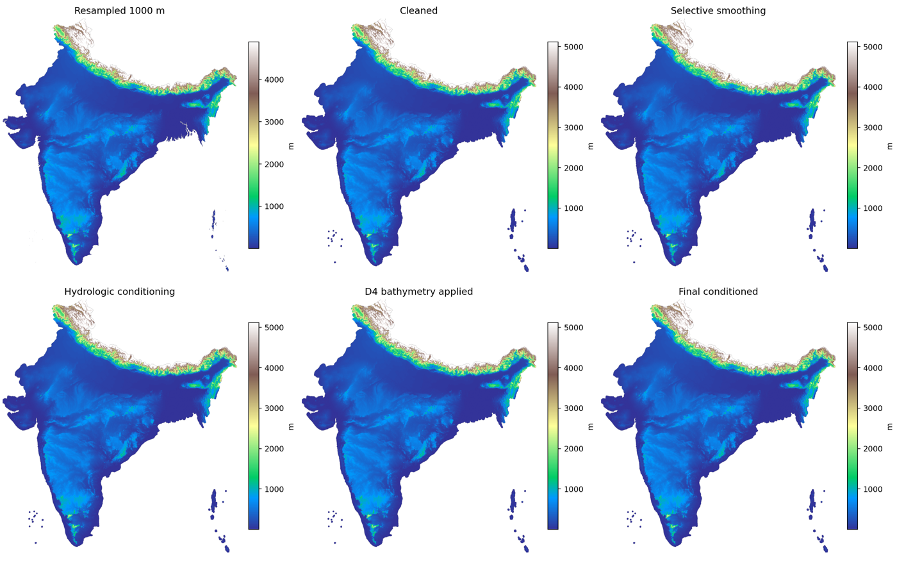
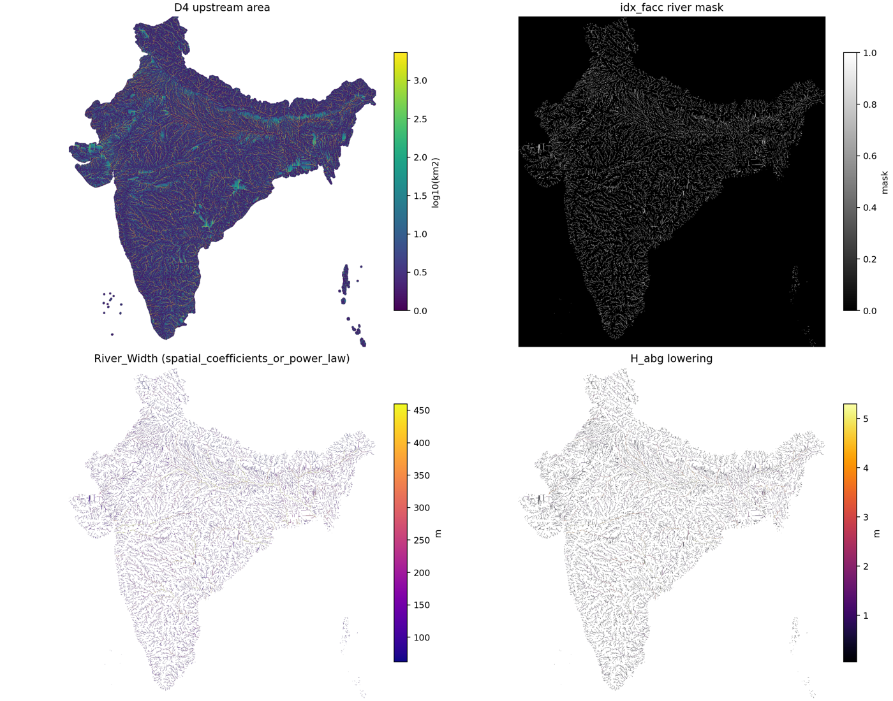
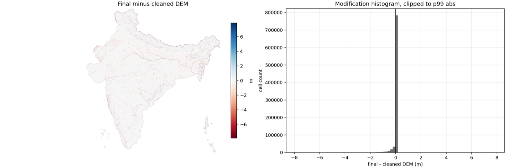
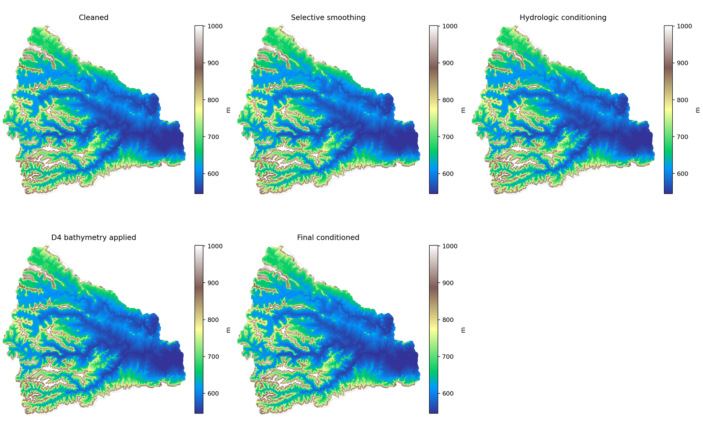
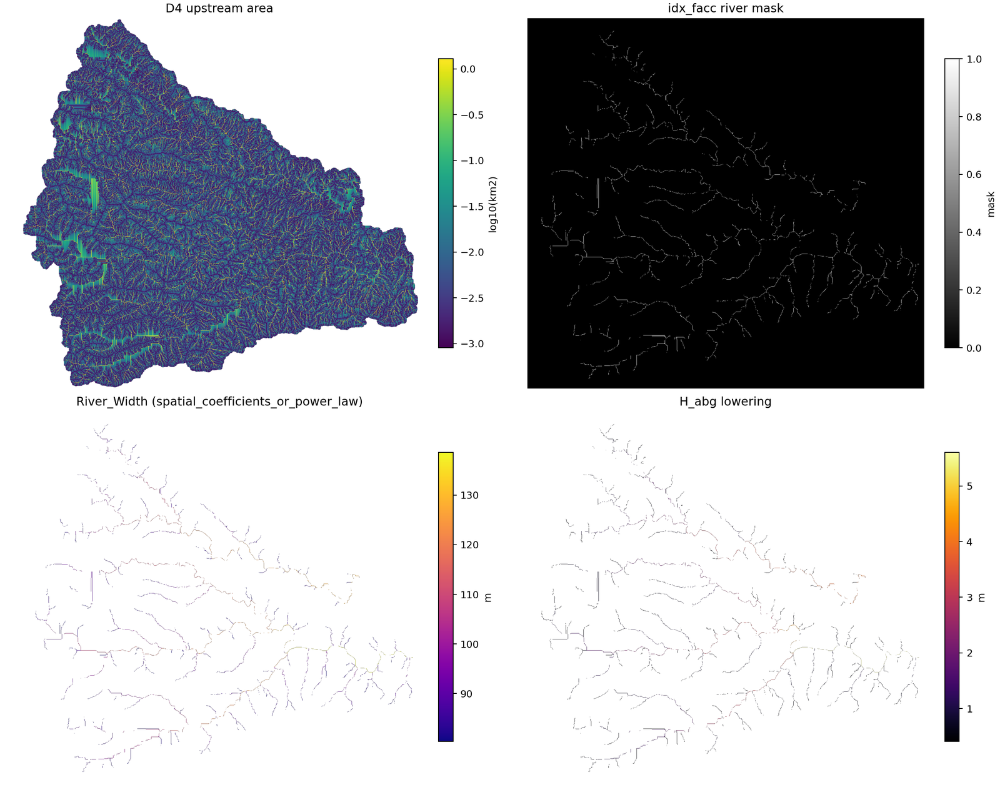
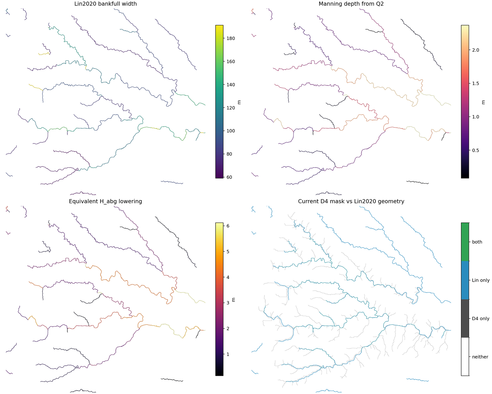
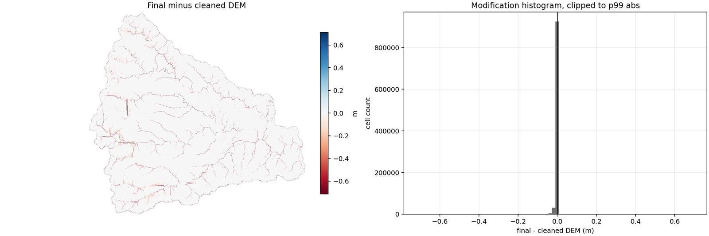

<p align="center">
  <h1 align="center">HydroBathyDEM</h1>
  <p align="center">
    River-aware DEM conditioning, D4 routing diagnostics, and bathymetry preparation for flood models.
  </p>
</p>

<p align="center">
  <a href="https://github.com/marcusnobrega-eng/HydroBathyDEM/blob/main/LICENSE">
    
  </a>
  
  
  
  
</p>

<p align="center">
  <a href="#-overview">Overview</a> |
  <a href="#-visual-diagnostics">Visual Diagnostics</a> |
  <a href="#-quick-start">Quick Start</a> |
  <a href="#-pune-30-m-mini-case">Mini Case</a> |
  <a href="#-complete-workflow">Workflow</a> |
  <a href="#-outputs">Outputs</a> |
  <a href="#-development">Development</a> |
  <a href="#-license">License</a>
</p>

---

## Overview

**HydroBathyDEM** is an installable Python toolbox for preparing DEMs for
hydrologic and hydrodynamic flood-model workflows. It focuses on the part of
DEM preprocessing where terrain conditioning, D4 routing, river extraction,
bankfull hydraulic geometry, and bathymetry lowering have to agree with one
another.

It currently supports workflows based on:

- **FABDEM or any projected DEM** readable by `rasterio`
- **D4 flow routing** for hydrodynamic model grids suc has LISFLOOD or HydroPol2D
- **Lin et al. 2020 global bankfull river width** data
- **Manning-based Q2 depth estimation**
- **spatial hydraulic-geometry calibration**
- **diagnostic plots, QA reports, and reproducible run manifests**

The toolbox is intentionally audit-heavy. It writes intermediate rasters,
diagnostic figures, CSV/JSON summaries, and a manifest so that every major DEM
change can be inspected before the final DEM is used in a flood model.

## Why HydroBathyDEM?

Most DEM conditioning tools can fill, breach, smooth, or burn channels. This
toolbox is more specific: it tries to preserve the connection between a model
grid, D4 drainage area, river-mask extraction, bankfull width/depth estimates,
and the final bathymetric lowering applied to the DEM.

The core logic is:

```text
DEM -> D4 drainage area -> river mask -> width/depth -> H_abg lowering -> QA
```

where:

```text
River_Width = beta_1(x,y) * A_D4 ^ beta_2(x,y)
River_Depth = alfa_1(x,y) * A_D4 ^ alfa_2(x,y)
H_abg = ((River_Width / Resolution) * River_Depth^(5/3))^(3/5)
```

## Visual Diagnostics

HydroBathyDEM is designed to make DEM changes visible, not just to produce a
final raster. A typical run writes diagnostic figures that show the starting
terrain, the conditioned terrain, the D4 river mask, bathymetry lowering, and
where the largest modifications happened.

### DEM Conditioning Stages

This overview compares the main DEM stages, including the cleaned DEM,
hydrologically conditioned surface, final hydraulic DEM, and final change map.



### D4 River Extraction And Bathymetry Inputs

The river diagnostic shows D4 upstream area, the extracted river mask, estimated
river width, and `H_abg` bathymetry lowering. This is the first place to inspect
whether the river network looks realistic for the chosen flow-accumulation
threshold.



### Largest DEM Changes

The final modification diagnostic highlights where the DEM was lowered or
raised relative to the cleaned DEM. This helps separate river bathymetry changes
from terrain-conditioning changes such as breaching or local pit repair.



## Features

- 🗺️ DEM resampling, NoData cleanup, selective smoothing, and hydrologic conditioning
- 🧱 FABDEM download, tile mosaicking, AOI clipping, reprojection, and optional gap filling
- 🌊 D4 flow direction, D4 flow accumulation, and river-mask extraction
- 📏 Lin et al. 2020 river-width download and preprocessing
- 📐 Manning-equation depth estimates from width, Q2, and slope
- 🧭 spatially varying hydraulic-geometry coefficients by D4 subcatchment
- 🧪 preflight checks for missing DEM, Lin, and coefficient inputs
- 📊 diagnostic plots for smoothing, D4 extraction, geometry source, and final DEM changes
- 🧾 QA scorecards and run manifests for reproducibility
- 📦 installable command-line package with `hydrobathydem-*` entry points

## Repository

```text
Repository : https://github.com/marcusnobrega-eng/HydroBathyDEM
Package    : hydrobathydem
License    : MIT
Status     : alpha / research toolbox
```

## Installation

Clone and install in editable mode:

```bash
git clone https://github.com/marcusnobrega-eng/HydroBathyDEM.git
cd HydroBathyDEM

python3 -m venv .venv
source .venv/bin/activate

python3 -m pip install --upgrade pip
python3 -m pip install -e .
```

Install the optional FABDEM downloader support when you want HydroBathyDEM to
fetch FABDEM directly from catchment bounds:

```bash
python3 -m pip install -e ".[fabdem]"
```

Install directly from GitHub:

```bash
python3 -m pip install git+https://github.com/marcusnobrega-eng/HydroBathyDEM.git
```

The bundled Pune mini-case files are meant for a cloned repository checkout.
Use the editable install above when you want to run the examples exactly as
shown below.

Check the installed commands:

```bash
hydrobathydem-condition --help
hydrobathydem-condition-1000m --help
hydrobathydem-prepare-lin2020 --help
hydrobathydem-calibrate-hydraulics --help
hydrobathydem-preflight --help
hydrobathydem-build-dem --help
```

## Quick Start

For a quick package test, run the tracked Pune 30 m mini case:

```bash
hydrobathydem-condition \
  --config examples/pune_catchment/configs/pune_30m_powerlaw_first_pass.json
```

The mini case includes a small projected FABDEM tile, so it works immediately
after cloning and installing the package. It writes outputs to:

```text
examples/pune_catchment/outputs/
```

For the larger India workflow, place your source DEM at the repository root or
point the config to it. The India configs use:

```text
DEM_fabdem.tif
```

Run the final workflow when Lin data and coefficient rasters already exist:

```bash
hydrobathydem-preflight \
  --config configs/india_1000m_spatial.json \
  --require-lin \
  --require-spatial-coefficients

hydrobathydem-condition-1000m \
  --config configs/india_1000m_spatial.json \
  --dry-run

hydrobathydem-condition-1000m \
  --config configs/india_1000m_spatial.json
```

The current India example uses:

```text
DEM/model resolution  = 1000 m
river threshold       = 100 km2
coefficient threshold = 5000 km2
geometry source       = spatial_coefficients_or_power_law
slope artifact mask   = 95th slope percentile
```

## Pune 30 m Mini Case

The repository includes a small Pune-area test case built from
`DEM_fabdem_pune.tif`. It is projected to `EPSG:32643`, uses 30 m cells, and is
small enough to keep in GitHub. This lets a new user test the package without
first downloading national DEM or Lin datasets.



The 30 m example uses smaller thresholds than the India setup:

```text
DEM/model resolution       = 30 m
river threshold            = 5 km2
Lin calibration threshold  = 20 km2
max H_abg lowering         = 8 m
geometry source options    = power_law or spatial_coefficients_or_power_law
```

Run the fast power-law version:

```bash
hydrobathydem-condition \
  --config examples/pune_catchment/configs/pune_30m_powerlaw_first_pass.json
```

Run the external-data version using the tracked Pune-only Lin subset and
calibration rasters:

```bash
hydrobathydem-preflight \
  --config examples/pune_catchment/configs/pune_30m_spatial.json \
  --require-spatial-coefficients

hydrobathydem-condition \
  --config examples/pune_catchment/configs/pune_30m_spatial.json
```

The Pune Lin subset contains 64 reaches in the padded DEM domain, with 44 valid
FABDEM-D4 matches. That is enough to test the full workflow, but too few for
meaningful local subcatchment-specific coefficient fits. The example therefore
uses the global Pune subset fallback in the coefficient rasters.







See [`examples/pune_catchment/README.md`](examples/pune_catchment/README.md)
for the full rebuild commands, Lin preprocessing command, and calibration
notes.

## Build A DEM From A Catchment

Users can either provide any projected DEM directly to the conditioning configs,
or build one from a catchment/AOI vector using FABDEM.

Automatic FABDEM download uses the optional
[`fabdem`](https://pypi.org/project/fabdem/) package, which accepts EPSG:4326
longitude/latitude bounds and downloads the intersecting FABDEM tiles. Install
the optional dependency first:

```bash
python3 -m pip install -e ".[fabdem]"
```

Then build a 30 m projected DEM from a catchment boundary:

```bash
hydrobathydem-build-dem \
  --download \
  --aoi path/to/catchment.gpkg \
  --output-dir Data/DEM/pune \
  --output-prefix DEM_fabdem_pune \
  --target-crs EPSG:32643 \
  --target-resolution 30 \
  --download-cache Data/FABDEM_cache \
  --fill-gaps
```

This writes:

```text
Data/DEM/pune/DEM_fabdem_pune_mosaic_native_unclipped.tif
Data/DEM/pune/DEM_fabdem_pune_native_clipped.tif
Data/DEM/pune/DEM_fabdem_pune_30m.tif
Data/DEM/pune/DEM_fabdem_pune_30m_filled.tif
Data/DEM/pune/fabdem_build_manifest.json
```

If you already downloaded and unzipped FABDEM tiles, use local-tile mode:

```bash
hydrobathydem-build-dem \
  --fabdem-dir Data/FABDEM_tiles \
  --aoi path/to/catchment.gpkg \
  --output-dir Data/DEM/pune \
  --output-prefix DEM_fabdem_pune \
  --target-crs EPSG:32643 \
  --target-resolution 30 \
  --recursive
```

After this, set the generated DEM path in a config:

```json
{
  "dem": "Data/DEM/pune/DEM_fabdem_pune_30m.tif",
  "out-dir": "Outputs/pune"
}
```

## Complete Workflow

Use this sequence when rebuilding from scratch, changing the DEM/grid
resolution, or regenerating Lin-calibrated hydraulic geometry.

### 0. Prepare or provide a DEM

Either use your own projected DEM, or create one with:

```bash
hydrobathydem-build-dem \
  --download \
  --aoi path/to/catchment.gpkg \
  --output-dir Data/DEM/catchment \
  --output-prefix DEM_fabdem_catchment \
  --target-crs EPSG:32643 \
  --target-resolution 30
```

Then point the conditioning config's `dem` field to the generated GeoTIFF.

### 1. Build first-pass FABDEM-D4 drainage products

```bash
hydrobathydem-condition \
  --config configs/india_1000m_powerlaw_first_pass.json
```

This creates:

```text
Outputs/dem/DEM_resampled_1000m.tif
Outputs/d4/D4_flow_direction.tif
Outputs/d4/D4_Wshed_Properties_fac_area_km2.tif
Outputs/d4/D4_idx_facc.tif
```

### 2. Download and process Lin et al. 2020 river geometry

```bash
hydrobathydem-prepare-lin2020 --download
```

This downloads the Lin et al. reach data if needed, clips it to the DEM domain,
computes Manning Q2 depth from `Width_m`, `Q2`, and slope, and writes:

```text
Data/Lin2020_bankfull_width/raw/
Data/Lin2020_bankfull_width/processed/
```

### 3. Calibrate spatial hydraulic geometry

```bash
hydrobathydem-calibrate-hydraulics \
  --selected-threshold-km2 5000 \
  --fit-area-source d4
```

This writes spatial coefficient rasters:

```text
Data/Lin2020_bankfull_width/calibration/D4_beta_1_width_5000km2.tif
Data/Lin2020_bankfull_width/calibration/D4_beta_2_width_5000km2.tif
Data/Lin2020_bankfull_width/calibration/D4_alfa_1_depth_5000km2.tif
Data/Lin2020_bankfull_width/calibration/D4_alfa_2_depth_5000km2.tif
```

### 4. Run final DEM conditioning

```bash
hydrobathydem-preflight \
  --config configs/india_1000m_spatial.json \
  --require-lin \
  --require-spatial-coefficients

hydrobathydem-condition-1000m \
  --config configs/india_1000m_spatial.json
```

## Outputs

HydroBathyDEM organizes generated products by theme:

```text
Outputs/dem/
  DEM_resampled_1000m.tif
  DEM_raw_cleaned.tif
  DEM_artifact_smoothed.tif
  DEM_hydrologically_conditioned_pre_bathymetry.tif
  DEM_reduced_creeks_D4.tif
  DEM_hydraulic_conditioned.tif
  DEM_modification_final_minus_cleaned.tif

Outputs/d4/
  D4_flow_direction.tif
  D4_flow_accum_cells.tif
  D4_Wshed_Properties_fac_area_km2.tif
  D4_idx_facc.tif
  D4_Wshed_Properties_River_Width_m.tif
  D4_Wshed_Properties_River_Depth_m.tif
  D4_H_abg_m.tif
  D4_spatial_coefficients_used.tif
  D4_power_law_fallback_used.tif

Outputs/diagnostics/
  diagnostic_smoothing_artifacts.png
  diagnostic_d4_river_extraction.png
  diagnostic_d4_threshold_sweep.png
  diagnostic_d4_mask_over_accumulation.png
  diagnostic_d4_geometry_source_map.png
  diagnostic_hydraulic_geometry_histograms.png
  diagnostic_final_modifications.png

Outputs/reports/
  conditioning_config.json
  run_manifest.json
  qa_scorecard.csv
  qa_scorecard.json
  qa_scorecard.md
  modification_summary.csv
  D4_HydroPol2D_creek_reduction_summary.csv
  D4_river_connectivity_summary.csv
```

Start QA here:

```text
Outputs/reports/qa_scorecard.md
Outputs/reports/run_manifest.json
Outputs/diagnostics/diagnostic_d4_river_extraction.png
Outputs/diagnostics/diagnostic_d4_geometry_source_map.png
Outputs/diagnostics/diagnostic_final_modifications.png
```

## Data Policy

Large files are intentionally excluded from Git:

```text
DEM_fabdem.tif
*.tif, *.tiff, *.gpkg, *.shp, *.zip
Data/Lin2020_bankfull_width/raw/
Data/Lin2020_bankfull_width/processed/
Data/Lin2020_bankfull_width/calibration/*.tif
Data/DEM/
Data/FABDEM_cache/
Data/FABDEM_tiles/
Outputs/
```

This repository stores code, docs, tests, example configs, and a small tracked
Pune mini-case. Users download or generate larger DEMs, Lin source data,
coefficient rasters, and model outputs locally.

## Project Layout

```text
pyproject.toml
MANIFEST.in
LICENSE
README.md
configs/
docs/
tests/
src/dem_processing/
Data/Lin2020_bankfull_width/
Outputs/
```

The public package is named `hydrobathydem`. The internal Python module is
currently `dem_processing`.

## Development

Run tests:

```bash
python3 -m unittest discover -s tests -v
```

Build a source distribution and wheel:

```bash
python3 -m pip install -e ".[dev]"
python3 -m build
```

This writes:

```text
dist/hydrobathydem-0.1.0.tar.gz
dist/hydrobathydem-0.1.0-py3-none-any.whl
```

## Citation And Data Sources

HydroBathyDEM currently uses Lin et al. 2020 bankfull river width data:

- [Zenodo record: Global estimates of reach-level bankfull river width](https://zenodo.org/records/3552776)

Please cite the underlying DEM and river datasets used in your application.

## License

HydroBathyDEM is released under the [MIT License](LICENSE).
