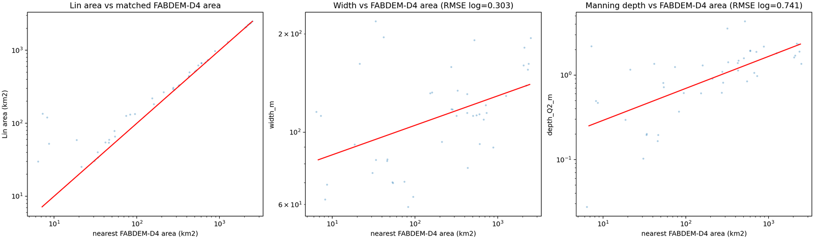

# Pune 30 m Mini Case

This example provides a small 30 m Pune-area DEM so users can test
HydroBathyDEM without downloading a national-scale raster.

## Input

```text
data/DEM_fabdem_pune.tif
```

The DEM is projected to `EPSG:32643` with 30 m cells. It is small enough to keep
in GitHub and is intended only as a fast package test case.

The example also includes a tiny Pune-only Lin et al. 2020 processed subset and
20 km2 calibration rasters. The full Lin raw shapefile is not tracked because it
is much larger than GitHub's practical repository limits.

## Why The Parameters Differ From The India Example

The main India workflow uses 1000 m model cells and a 100 km2 river threshold.
For this small 30 m catchment, those values would be too coarse. The mini case
uses:

```text
cell size                  = 30 m
river extraction threshold = 5 km2
calibration zone threshold = 20 km2
max H_abg lowering         = 8 m
breach search distance     = 300 cells, about 9 km
```

For Lin matching, this mini case uses a 5 km search radius and wide area-ratio
filters. That is intentionally permissive because FABDEM-D4 and MERIT-derived
Lin reaches do not align perfectly at 30 m. The QA figures should be inspected
before treating the spatial coefficients as calibrated production parameters.

## Example Figures





## Fast Power-Law Test

This test does not require Lin et al. data:

```bash
hydrobathydem-condition \
  --config examples/pune_catchment/configs/pune_30m_powerlaw_first_pass.json
```

Inspect:

```text
examples/pune_catchment/outputs/dem/DEM_hydraulic_conditioned.tif
examples/pune_catchment/outputs/d4/D4_idx_facc.tif
examples/pune_catchment/outputs/d4/D4_H_abg_m.tif
examples/pune_catchment/outputs/reports/qa_scorecard.md
examples/pune_catchment/outputs/diagnostics/diagnostic_d4_river_extraction.png
examples/pune_catchment/outputs/diagnostics/diagnostic_final_modifications.png
```

## Spatial Coefficient Test

The repository includes the small derived Lin subset and coefficient rasters
needed by this config:

```bash
hydrobathydem-preflight \
  --config examples/pune_catchment/configs/pune_30m_spatial.json \
  --require-spatial-coefficients

hydrobathydem-condition \
  --config examples/pune_catchment/configs/pune_30m_spatial.json
```

The included calibration has:

```text
Lin reaches in padded DEM domain = 64
valid matched calibration samples = 44
selected coefficient threshold    = 20 km2
global width fit                  = 69.19 * A^0.090
global depth fit                  = 0.122 * A^0.378
local valid coefficient zones     = 0
```

This means the mini case is a good end-to-end software test, but not a strong
local hydraulic-geometry calibration. At this size, there are too few Lin
samples per subcatchment, so the coefficient rasters mostly carry the robust
global fallback derived from the Pune subset.

## Rebuild The Lin2020 Subset

If the full Lin et al. 2020 raw shapefile has already been downloaded, this
rebuilds the tracked Pune-only subset from the D4 grid:

```bash
hydrobathydem-prepare-lin2020 \
  --raw-dir Data/Lin2020_bankfull_width/raw \
  --processed-dir examples/pune_catchment/data/lin2020/processed \
  --dem-grid examples/pune_catchment/outputs/dem/DEM_raw_cleaned.tif \
  --d4-mask examples/pune_catchment/outputs/d4/D4_idx_facc.tif \
  --bbox-pad-deg 0.05 \
  --depth-cap-m 20 \
  --max-H-abg-m 8 \
  --rasterize-buffer-m 45 \
  --all-touched
```

Then calibrate smaller local coefficient zones:

```bash
hydrobathydem-calibrate-hydraulics \
  --fac-area examples/pune_catchment/outputs/d4/D4_Wshed_Properties_fac_area_km2.tif \
  --d4-direction examples/pune_catchment/outputs/d4/D4_flow_direction.tif \
  --lin-gpkg examples/pune_catchment/data/lin2020/processed/lin2020_dem_domain_width_depth.gpkg \
  --out-dir examples/pune_catchment/data/lin2020/calibration \
  --selected-threshold-km2 20 \
  --thresholds-km2 5,10,20,50 \
  --fit-area-source d4 \
  --match-network-threshold-km2 5 \
  --application-min-area-km2 5 \
  --max-nearest-distance-m 5000 \
  --min-area-ratio 0.01 \
  --max-area-ratio 100 \
  --min-samples-per-zone 5 \
  --min-log10-area-range 0.05 \
  --max-H-abg-m 8
```
